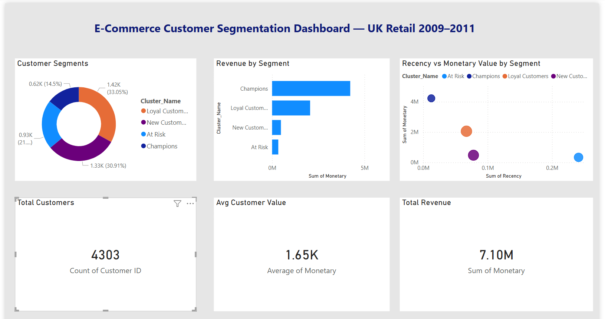

# 🛒 E-Commerce Customer Segmentation Analysis

End-to-end customer segmentation on 1.07M+ UK retail transactions using 
RFM analysis and K-Means clustering to identify high-value and at-risk customers.

## 📌 Table of Contents
- [Project Overview](#project-overview)
- [Live Dashboard](#live-dashboard)
- [Power BI Dashboard](#Power-bi-dashboard)
- [Key Result](#key-result)
- [Business Problem](#business-problem)
- [Analysis Steps](#analysis-steps)
- [Tech Stack](#tech-stack)
- [Project Structure](#project-structure)
- [How to Run](#how-to-run)
- [Dataset](#dataset)
---

## Project Overview

This project transforms raw transactional data (~1.07 million rows) from a UK-based online retail store into actionable customer intelligence. Using **RFM (Recency, Frequency, Monetary)** feature engineering and **K-Means clustering**, customers are grouped into 4 distinct behavioral segments — each mapped to a tailored marketing strategy.

---

## 🚀 Live Dashboard
👉 [View Interactive Dashboard](https://ecommerce-customer-analysis-jqzy8aeurhccjtmttyvzw3.streamlit.app/)

---
## 📊 Power BI Dashboard



---
## 📌 Key Results

| Segment | % of Customers | Revenue Contribution |
|---|---|---|
| Champions | 14.5% | 60% of £7.1M total |
| Loyal Customers | 33.0% | Strong repeat spend |
| New Customers | 30.9% | Recent acquisitions |
| At Risk | 21.5% | £420K+ recoverable |

**Projected revenue impact from targeted strategy: £420K+ annually (6% growth)**

---

## 🧩 Business Problem

Most e-commerce businesses treat all customers the same — sending identical 
promotions regardless of behavior. This wastes marketing budget and accelerates 
churn among high-value customers.

This project answers:
- Who are our most valuable customers and what do they look like?
- Which customers are about to leave — and how do we win them back?
- How do we move from generic campaigns to targeted segment strategies?

---

## 🔍 Analysis Steps

1. **Data Cleaning** — handled 1.07M+ rows, missing CustomerIDs, 
   negative quantities, duplicate invoices
2. **Exploratory Data Analysis** — revenue trends, top products, 
   country distribution, seasonal patterns
3. **Feature Engineering** — built RFM metrics (Recency, Frequency, 
   Monetary Value) per customer
4. **Modeling** — K-Means clustering with Elbow Method + Silhouette 
   Score to find optimal k=4
5. **Interpretation** — mapped clusters to business segments, 
   quantified revenue impact per segment
6. **Dashboard** — deployed interactive Streamlit app for non-technical stakeholders

---

## 🛠️ Tech Stack

| Tool | Purpose |
|---|---|
| Python (Pandas, NumPy) | Data cleaning & feature engineering |
| Scikit-learn | K-Means clustering, scaling |
| Matplotlib, Seaborn | EDA visualizations |
|Power BI | Dashboard |
| Streamlit | Interactive dashboard deployment |
| Jupyter Notebook | Analysis environment |
| Git & GitHub | Version control |

---

## 📁 Project Structure
```
ecommerce-customer-analysis/
├── data/
│   ├── raw/                               # Original, immutable data (not tracked in Git)
│   └── processed/                         # Cleaned & feature-engineered data
├── notebooks/
│   ├── 02_data_cleaning.ipynb             # Data cleaning & preprocessing
│   ├── 03_eda.ipynb                       # Exploratory Data Analysis
│   ├── 04_feature_engineering.ipynb       # RFM metric creation
│   ├── 05_clustering.ipynb                # K-Means segmentation
│   ├── 06_recommendations_dashboard.ipynb # Business recommendations
│   └── E-Commerce_Customer_Segmentation_project.ipynb  # Combined end-to-end notebook
├── images/                                # Charts and visualisations
├── app.py                                 # Streamlit app for interactive exploration
├── powerbi_dashboard.pdf                  # Power BI dashboard (PDF export)
├── powerbi_dashboard.png                  # Power BI dashboard (preview image)
├── customer_segmentation_dashboard.png    # Segmentation cluster visualisation
├── requirements.txt                       # Python dependencies
├── .gitignore
└── README.md
```

## ▶️ How to Run Locally
```bash
git clone https://github.com/Shraddha964-dev/ecommerce-customer-analysis.git
cd ecommerce-customer-analysis
pip install -r requirements.txt
streamlit run app.py
```

---

## 📊 Dataset

**Source:** [UCI Machine Learning Repository — Online Retail II](https://archive.ics.uci.edu/dataset/502/online+retail+ii)  
**Size:** ~1.07 million transactions · 4,300+ unique customers  
**Period:** December 2009 – December 2011 · UK-based online retailer

---

## 👩‍💻 About ME

I am actively seeking entry-level opportunities in Data Analyst and continuously building projects to strengthen my skills.

If you have suggestions or feedback, feel free to share.

If you find this helpful, feel free to star the repository!

If you liked what you saw, want to have a chat with me about the portfolio, work opportunities, or collaboration, shoot an email at ssajane86@gmail.com.

[LinkedIn](https://www.linkedin.com/in/shraddha-sajane) | 
[GitHub](https://github.com/Shraddha964-dev) |
[SQL Portfolio Project](https://github.com/Shraddha964-dev/banking-transaction-sql-analysis)
